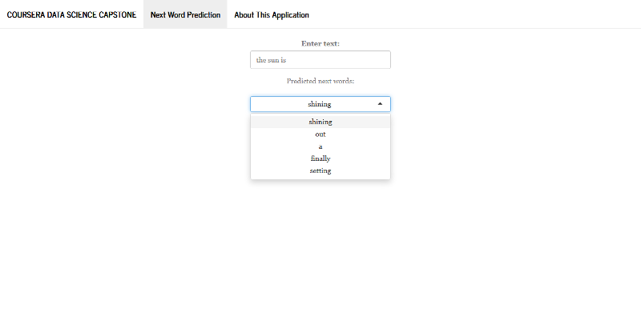

### Data Science Capstone Project

This is a Capstone Project of [Data Science Specialization of John Hopkins University](https://www.coursera.org/specializations/jhu-data-science) in cooperation with [Swiftkey](https://swiftkey.com)

-------------

#### Objectives

The main objective is to build a predictive text mining application in Shiny and apply data science in the area of natural language processing.

-------------

#### Methods

The data used to build the Corpus comes from a the repositoy [HC Corpora](https://web-beta.archive.org/web/20160930083655/http://www.corpora.heliohost.org/aboutcorpus.html). These dataset contains references from (1) Twitter, (2) Blogs and (3) from News.

The project has included the following tasks:

* Sampling and importing the text repositories to build the training Corpus
* Transformation, including tidying up the texts, transform them into structured formats
* Build the n-gram model for predicting the next word.
* Improve the model to hadle unseen n-grams using smoothing techniques, in this case, a [Katz's Back-off Model](https://en.wikipedia.org/wiki/Katz%27s_back-off_model) was used.
* Export the language model to data tables to build the app.

All processing was done using a well-known R packages for text mining, mainly: `tm` and `quanteda` packages.  

-------------

#### The application interface

The application interface is quite simple: user types text in the input field labeled as "Enter text". The application fetches the predicted next words as a select input options, refreshing as user keeps on typing additional text.

-------------

#### Additional information

* The application is hosted at [Shinyapps.io](https://ralvite.shinyapps.io/appdscapstoneproject/)
* Source code can be found at [GitHub](https://github.com/ralvite/10_Capstone_project)
* Pitch can be found at [GitHub pages](https://ralvite.github.io/10_Capstone_project/presentationDSCapstoneProject/presentationDSCapstoneProject.html#1)

