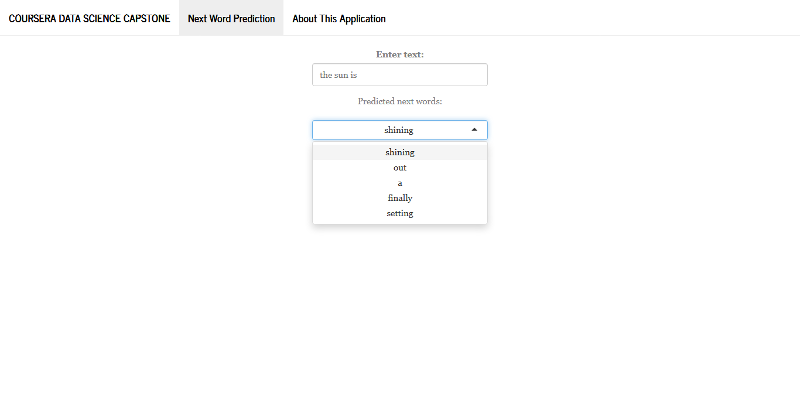

```{r setup, include=FALSE}
knitr::opts_chunk$set(echo = FALSE)
```

## Introduction

This is a Capstone Project of [Data Science Specialization of John Hopkins University](https://www.coursera.org/specializations/jhu-data-science) in cooperation with [Swiftkey](https://swiftkey.com)

#### Objectives  
The main objective is to build a predictive text mining application in Shiny and apply data science in the area of natural language processing.

#### N-gram Language models  

* Given a sequence of words, a language model can be used to predict the probability of upcoming words given the previous words
* In a n-gram model, the probability of the next word $w_i$ depends only on the previous $w_{i-1}$ word (First order Markov assumption)
* Maximum-likelihood probability estimates (MLE), maximize the likelihood on the training data
$$
P(w_n | w_1,w_2,\cdots,w_{n-1}) = \frac{c(w_1 \cdots w_n)}{c(w_1 \cdots w_{n-1})}
$$

* Back-off to lower order model when we have zero evidence for a higher order N-gram

## How the language model works

Part 1:

* Sampling and importing the text repositories to build the training Corpus
* Transformation, including tidying up the texts, transform them into structured formats
* Build the n-gram model (tockenization) up to 3-gram for predicting the next word 
* Improve the model to hadle unseen n-grams using smoothing techniques, in this case, a [Katz's Back-off Model](https://en.wikipedia.org/wiki/Katz%27s_back-off_model) with Good-Turing Discounting was used.
* Create N-gram lookup tables for 3-gram, 2-gram, and 1-gram tokens to build the app.

Part 2: Predicting Given a New Phrase

* Clean the supplied phrase, take the final 3 words, and convert them to $w_{i-1},w_{i}$ pairs
* Find matches in all N-gram tables, discarding any that would predict a "stop word"
* Using a Katz's Back-off Model, assign probabilities and return the top predictions

All processing was done using a well-known R packages for text mining, mainly: `tm` and `quanteda` packages.

## Prediction performance

Test corpus: 275,000 lines / 56.5M words

* Cross-entropy: 3.137 (3-grams)
* Accuracy: 24.8% (3-grams)
* Average Speed performance: 22ms (per 3-gram query)


## Text Prediction App

The application interface is quite simple: user types text in the input field labeled as "Enter text". The application fetches the five next words predicted by the model as a select input, refreshing as user keeps on typing additional text.




